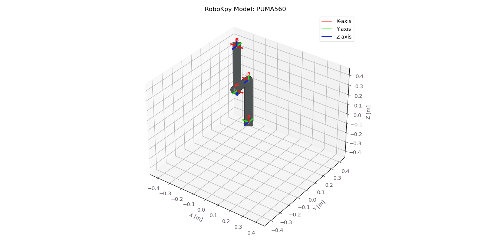

# RoboKpy

[](https://www.python.org/)
[](https://www.apache.org/licenses/LICENSE-2.0)
[](#)
[](https://github.com/Silas-U/RoboKpy)

**RoboKpy** is a modular and extensible Python library for performing robotic kinematic analysis.  
It provides a clean object-oriented framework for **Forward Kinematics**, **Inverse Kinematics**, **Jacobian computation**, **Trajectory Planning**, and **3D Visualization**.

---

## RoboKpy provides

-  Modular design with independent kinematic modules (FK, IK, Jacobian, Trajectory, Visualization)
-  Support for **Revolute** and **Prismatic** joints
-  Built-in **DH model library** for common robots (2DOF, PUMA560, SCARA, etc.)
-  **Jacobian** computation
-  **Iterative IK solver** with damping and convergence checks
-  **Joint-space** and **Task-space** trajectory generation
-  **3D visualization** of robot motion and coordinate frames
-  Intuitive high-level API for quick prototyping

---

## Trajectory planning preview
```python
  robot.traj.scale_waypoint_vel = 2.0
```
<p align="center">
  
</p>

```python
  robot.traj.scale_waypoint_vel = 0.0
```
<p align="center">
  
</p>

## Getting started

#### RoboKpy requires Python >= 3.6 so make sure python is installed on your machine.
### Create a Virtual Environment
Open your terminal inside your project folder (RoboKpy/) and run:
#### Windows
```bash
python -m venv venv
venv\Scripts\activate
```
#### macOS/Linux

```bash
python3 -m venv venv
source venv/bin/activate
```
You should see:
```bash
(venv) C:\Users\...
```
This means you are inside the virtual environment.

## Install from GitHub
Install from main
```bash
pip install git+https://github.com/Silas-U/RoboKpy.git
```
Install from a release/tag
```bash
pip install git+https://github.com/Silas-U/RoboKpy.git@v1.0.0
```

## Code Examples

We will load the DH parameters of the Puma560 robot defined in the ```Model.py``` file and print the DH table.
```python
from robokpy import Init_Model
from Model import DHModel

DHModel.print_dh_table('Puma560')
model_params = DHModel.get_model('Puma560')
```
You should see the DH table displayed on your terminal
```bash
DH Parameters : Puma560:

joint_name joint_type  link_length  twist  joint_offset  theta  offset
        j1          r       0.0000   90.0        0.0000    0.0     0.0
        j2          r       0.4318    0.0        0.0000    0.0     0.0
        j3          r       0.0203  -90.0        0.1500    0.0     0.0
        j4          r       0.0000   90.0        0.4318    0.0     0.0
        j5          r       0.0000  -90.0        0.0000    0.0     0.0
        j6          r       0.0000    0.0        0.0000    0.0     0.0
```
We will initialize the DH model using the model parameters we loaded, compute the forward kinematics and print the end effector transformation matrix and pose
```python
robot = Init_Model(model_params, robot_name='PUMA560', plt_model=False)

qn = [0, 0.7854, 3.1416, 0, 0.7854, 0]
robot.fk.compute(qn, rads=True)

print("End-effector transform:\n", robot.fk.get_htm(),'\n')
print("End-effector pose:", robot.fk.get_target(),'\n')
```
```bash
End-effector transform

 [[ 0.00001102  0.          1.          0.59630552]
  [-0.          1.         -0.          0.15      ]
  [-1.         -0.          0.00001102 -0.01435103]
  [ 0.          0.          0.          1.        ]] 

End-effector pose: [ 0.59630552,  0.15,  -0.01435103,  -0,  1.57078531, -0 ] 
```
We can also compute the robots Jacobian.
```python
J = robot.jac.compute()
print("\nJacobian Matrix:\n", J) 
```
The Jacobian matrix is a 6×n matrix which maps the joint speeds of the robot to the end-effector’s linear and angular velocities, in this case a 6×6 matrix for a 6 degree of freedom robot.

```bash
Jacobian Matrix:
 [[ 0.15        0.01435103  0.3196803   0.         -0.         -0.        ]
  [ 0.59630552  0.          0.         -0.          0.          0.        ]
  [-0.          0.59630552  0.29097738  0.          0.          0.        ]
  [ 0.          0.          0.          0.70711327 -0.          1.        ]
  [ 0.         -1.         -1.         -0.         -1.         -0.        ]
  [ 1.          0.          0.         -0.70710029  0.          0.00001102]]
```
We can solve inverse kinematics very easily. We set an initial guess which helps our inverse kinematics solver converge faster and choose a pose defined in terms of position and orientation.

```python
robot.ik.initial_guess([0, 90, -90, 0, 0, 0 ])

qr = [ 0.02029841, -0.15,  0.8636,   0,   0,   0]
ik_solution = robot.ik.solve(qr)
print("\nIK Solution (rads):", ik_solution)
```

```bash
IK Solution (rads): [0.0, 1.5708, -1.5708, 0.0, 0.0, 0.0]
```
We can also get the result in degrees by setting the ```output_deg``` option to ```True```

```python
ik_solution = robot.ik.solve(qr, output_deg=True)
```
```bash
IK Solution (deg): [0.0, 90.0, -90.0, 0.0, 0.0, 0.0]
```
We can visualize the ready pose ```qr``` configuration which shows a skeleton of the robot with lines that connect the link coordinate frames as defined by the Denavit-Hartenberg parameters.

To show or plot DH models always make sure to set the ```plt_model``` to ```True```

```python
robot = Init_Model(model_params, robot_name='PUMA560', plt_model=True)
```

```python
robot.mviz.scale_viz(0.45, 0.05)
robot.mviz.show_dh_model(ik_solution)
```
<p align="center">
</td>
</p>

## Run some examples
have a look in the RoboKpy [examples](https://github.com/Silas-U/RoboKpy_new/tree/main/Examples)
folder for many ready to run examples.

Here we present some predefined DH models, feel free to add yours.

| Model Name | Type | DOF | Description |
|:------------|:------|:----|:------------|
| `Puma560` | Revolute | 6 | Classic research manipulator |
| `UR10` | Revolute | 6 | Industrial arm (Universal Robots) |
| `Cobra600` | SCARA | 4 | Selective compliance robot arm |
| `Cylindrical` | Mixed | 4 | R-P-P-P robot |
| `scara` | Revolute + Prismatic | 3 | Compact SCARA arm |
| `2dof`, `6dof` | Custom | Variable | Example models for testing |

---

## Dependencies

- numpy
- scipy
- matplotlib
- pandas

Install them manually if needed:
```bash
pip install numpy scipy matplotlib pandas
```

---

## Contributing

Contributions are welcome!  
To add a new robot model:
1. Edit `Models.py` and append your robot DH parameters to `DHModel.MODELS`
2. Submit a pull request with a clear description

---

## License

RoboKpy is licensed under the **Apache License 2.0**.  
See the full license at: [Apache.org/licenses/LICENSE-2.0](https://www.apache.org/licenses/LICENSE-2.0)

---

## Author

**Silas Udofia**  
📅 2024  
🔗 [GitHub – Silas-U](https://github.com/Silas-U)
